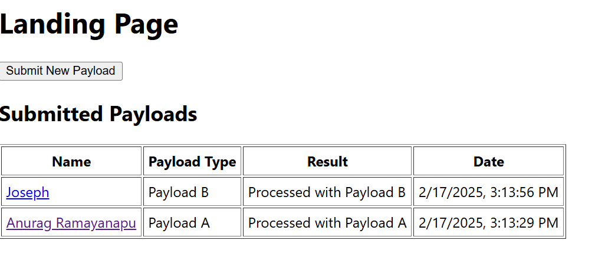

# MERN Stack Payload Processing App

This is a full-stack MERN application built for a coding challenge. The app demonstrates a simple payload processing workflow with a landing page, payload submission form, and detailed report view. It also includes placeholders for additional features like authentication, cloud storage, containerization, and file uploads.

## Features

### Landing Page (/home):

- Button to navigate to the payload submission form.
- Table displaying submitted payloads with their results and submission dates.

### Payload Form Page (/form):

- Form that collects various inputs (text, date, and categorical values).
- Three buttons to submit different dummy payloads.
- Asynchronous payload processing simulated with a delay.
- Redirects to the landing page after submission.

### Payload Form Page (/form):

- Detailed view of a specific payload.
- Displays raw form data and the processed result.
- Shows a "Processing..." message if the payload result isn't ready yet.

### Backend:

- RESTful API built with Express and MongoDB (using Mongoose) to manage payloads.
- Simulated asynchronous processing of payloads.

## Setup & Installation

### Prerequisites

- Node.js and npm installed
- MongoDB running locally

### Clone the Repository

- `git clone https://github.com/anuragkrama/mern-test.git`
- `cd mern-test`

### Install Backend Dependencies and Start Backend Server

- `cd backend`
- `npm install`
- `node index.js`

### Install Frontend Dependencies and Start Frontend Server

- `cd frontend`
- `npm install`
- `npm start`

## Usage

### Navigate to the Home Page:

Visit http://localhost:3000/home to see a list of payloads and a button to submit a new one.

### Submit a Payload:

Click the "Submit New Payload" button to go to the form at http://localhost:3000/form. Fill out the form and select one of the three payload buttons to submit the data. The payload processing will be simulated asynchronously.

### View Payload Reports:

On the Home page, click on any payload's name to view the detailed report at http://localhost:3000/report/:id.

## Screenshot

### Thanks for consdering me for this position. Looking forward to working with you.
